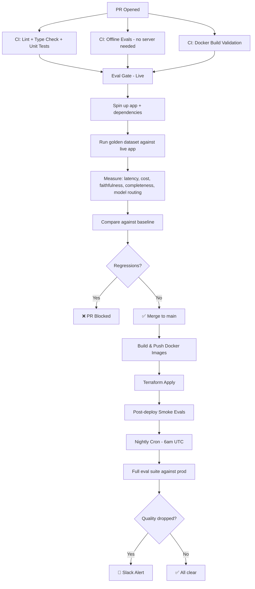
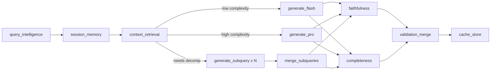
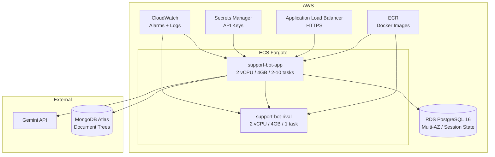

# CI/CD Pipelines for AI Agents: How to Stop Shipping Broken Prompts [Tutorial With Code]

**Sarthak Rastogi** · Jul 2026

---

It's Tuesday morning. You open Slack to a message from your PM: "3 users reported the bot told them AppleCare covers water damage for free, no service fee. Legal is asking questions."

You check the git log. Nothing was deployed since Friday. You check the prompts — no changes. You check the RAG documents — they still clearly say "$149 service fee for liquid damage." You check LangSmith traces... and there it is. The model is ignoring the retrieved context and hallucinating policy details from its parametric knowledge. Faithfulness scores tanked over the weekend.

What happened? Google pushed a minor Gemini update. No changelog. No email. Your prompts that worked on Friday don't work on Monday. And you had no way of knowing until users complained.

This is the problem.

<!-- MEME OPTIONS (pick one):
  1. "I'm something of a scientist myself" (Willem Dafoe) — captioned "Me after adding one eval to my CI pipeline"
  2. Squidward looking out the window meme — inside: "me, shipping without evals" / outside: "teams with eval-gated deploys sleeping peacefully"
  3. "We are not the same" Gus Fring — "You test your code. I test my model's behavior. We are not the same."
  4. The "it's the same picture" (Pam from The Office) — comparing "silent model update" and "production outage"
-->

Traditional CI/CD is straightforward. You write tests, tests pass, you deploy. If the tests fail, the deploy is blocked. Simple. Deterministic. A function that returned 4 yesterday will return 4 today.

LLMs don't work like that. Your code can be perfect and your agent can still be broken — because the model changed underneath you, or a prompt that scored 0.9 on faithfulness last week now scores 0.4, or the routing logic is sending simple questions to the expensive model and burning through your budget.

This article is about building a CI/CD pipeline that handles this. We're building on top of the Apple support bot from my last article — if you haven't read that one, the short version is: it's a LangGraph agent with RAG, safety gates, query decomposition, and output validation. It uses Gemini 3.5 Flash for simple queries and Gemini 3.1 Pro for complex ones (swappable to GPT-4o via env var). Full architecture, production-ready.

The repo is at https://github.com/sarthakrastogi/production-ai-app

By the end you'll have:
- An eval suite that tests your agent's behavior, not just its code
- GitHub Actions workflows that gate deploys on eval quality
- Terraform that provisions your entire AI infra
- A nightly regression catcher for when model providers silently break you

---

## Why AI CI/CD is a different beast

Here's the thing. In traditional software, your tests are binary. Pass or fail. The function either returns the right value or it doesn't.

In AI apps, your "tests" are probabilistic. You're asking: is this response good enough? Did the model route to the right tool? Did latency stay within budget? Did we spend too many tokens? Is the answer faithful to the retrieved context?

And the goalposts move. Not because you changed anything -- because your dependencies (the model providers) change underneath you without notice.

GitHub's Copilot team [built an eval harness](https://github.blog/ai-and-ml/github-copilot/evaluating-performance-and-efficiency-of-the-github-copilot-agentic-harness-across-models-and-tasks/) that runs thousands of code completion scenarios against their agents before shipping. Uber's [Michelangelo platform](https://www.uber.com/blog/michelangelo-machine-learning-platform/) includes health-check-based rollback for model deployments when metrics degrade. This isn't a nice-to-have. If you're shipping AI to prod, this is table stakes.

The tools we're using:
- **GitHub Actions** for the pipeline orchestration
- **A custom eval suite** (golden dataset + offline + live evals)
- **Terraform** for AWS infrastructure (ECS Fargate, RDS, CloudWatch)
- **LangSmith** for trace verification (the observability layer from the last article pays off here)

### The full pipeline

<!-- IMAGE: Excalidraw architecture diagram showing the full CI/CD flow (you're making this one) -->



---

## Layer 1: The eval dataset

Every CI/CD pipeline for AI starts with the same question: what does "correct" look like?

You need a golden dataset. This is a set of test cases where you know what the right behavior is -- not necessarily the exact output (that's too brittle for LLMs), but the right *properties* of the output.

For our Apple support bot, each test case specifies:

```json
{
  "id": "icloud-cancel-photos",
  "query": "How do I cancel my iCloud subscription, and will I lose my photos?",
  "expected_intent": "account_management",
  "expected_topics": ["icloud", "subscription", "photos", "cancellation"],
  "expected_complexity": "high",
  "expected_model": "pro",
  "needs_decomp": true,
  "sub_query_count": 2,
  "reference_answer": "To cancel iCloud+, go to Settings > [your name] > Subscriptions...",
  "max_latency_ms": 15000,
  "max_tokens": 800
}
```

Notice what we're testing here. Not the exact words of the response -- that would break every time the model rephrases things slightly. We're testing the agent's behavior:

1. **Did it route to the right model?** A high-complexity question should go to the pro model, a simple one to flash.
2. **Did it decompose correctly?** A multi-part question should fan out into sub-queries.
3. **Was the response faithful?** The app's own Ragas faithfulness scorer tells us if the answer is grounded in retrieved context.
4. **Was it complete?** Our completeness judge checks if all sub-questions were answered.
5. **Was it fast enough?** 15 seconds max for a complex query.
6. **Was it cheap enough?** Token budgets matter when you're paying per request.

We're NOT testing the safety middleware (Rival AI, PII scrubbing) here. Those are static services -- they don't change when you push a commit. The evals focus on the LangGraph agent itself: the parts that change when you modify prompts, swap models, or adjust routing logic.

The dataset lives in `evals/datasets/golden.json` and covers the key scenarios: simple queries (flash model), complex queries (pro model), and multi-part decomposition (fan-out).

Braintrust (the eval platform) has [written about this pattern extensively](https://braintrust.dev/docs/evaluate/write-scorers.md) -- they call it "scorers" and their whole product is built around the idea that you define assertions about properties of the output, not the output itself. [Promptfoo](https://www.promptfoo.dev/docs/integrations/github-action/) does similar things. The principle is the same whether you use a framework or roll your own.

We're rolling our own because it's not that much code and you'll understand exactly what's happening.

---

## Layer 2: Offline evals (fast, no server)

The first line of defense runs in seconds, not minutes. These are evals that don't need a running server -- they test the logic around the AI, not the AI itself.

```python
# evals/eval_offline.py

async def eval_query_intelligence_routing():
    """
    Verify that the routing logic produces correct model selection
    based on complexity and decomposition needs.
    """
    dataset = json.loads(DATASET_PATH.read_text())

    for case in dataset:
        expected_complexity = case.get("expected_complexity")
        expected_decomp = case.get("needs_decomp", False)
        expected_sub_count = case.get("sub_query_count")

        # Simulate state after query_intelligence runs
        state = {
            "needs_decomp": expected_decomp,
            "sub_queries": [case["query"]] * (expected_sub_count or 1),
            "complexity": expected_complexity or "low",
        }

        # Apply routing logic (mirrors execution.route_execution)
        if state["needs_decomp"] and len(state["sub_queries"]) > 1:
            actual_route = "fan_out"
        elif state["complexity"] == "low":
            actual_route = "generate_flash"
        else:
            actual_route = "generate_pro"

        # assert actual matches expected...
```

What this covers:
- **Routing logic correctness** -- if the query intelligence says "high complexity", does the router send it to the right model?
- **Decomposition consistency** -- are multi-part queries correctly flagged for fan-out? Does the sub-query count match?
- **Model assignment** -- does `expected_complexity: "low"` always map to flash, and "high" always to pro?
- **Prompt file integrity** -- do all referenced prompt files exist and are they non-empty? You'd be surprised how often a prompt file gets accidentally deleted or emptied in a merge conflict.
- **Token budget estimates** -- will any of our test cases blow past the context window? Catches prompt bloat before it hits prod.

These run in ~2 seconds on CI. No API keys needed. No Docker. No external services. First thing that runs on every push.

<!-- IMAGE: screenshot of terminal-output.html (the `make evals-offline` section) -->

You can (and should) run these locally before opening a PR:

```bash
make evals-offline    # routing, prompts, token budgets — 2 seconds
make evals            # full live eval suite (needs app running locally)
```

```yaml
# .github/workflows/ci.yml (excerpt)
offline-evals:
  runs-on: ubuntu-latest
  steps:
    - uses: actions/checkout@v4
    - uses: actions/setup-python@v5
      with:
        python-version: "3.11"
        cache: pip
    - run: pip install -r requirements.txt
    - run: python -m evals.eval_offline
```

---

## Layer 3: Live evals (the deployment gate)

This is where it gets serious. On every PR, we spin up the actual app with real dependencies and run the golden dataset against it.

```yaml
# .github/workflows/eval-gate.yml
live-evals:
  runs-on: ubuntu-latest
  timeout-minutes: 15
  services:
    postgres:
      image: postgres:16-alpine
      env:
        POSTGRES_DB: support_bot
        POSTGRES_USER: postgres
        POSTGRES_PASSWORD: postgres
      ports:
        - 5432:5432
    mongodb:
      image: mongo:7
      ports:
        - 27017:27017
```

GitHub Actions service containers give us Postgres and MongoDB for free in CI. The app starts in the background, we wait for the health check, then hammer it with the eval suite.

The eval runner measures everything:

```python
# evals/run_evals.py (core logic)
async def run_single_eval(client, case):
    start = time.perf_counter()
    resp = await client.post(f"{APP_URL}/query", json={"query": case["query"]}, ...)
    latency_ms = (time.perf_counter() - start) * 1000

    data = resp.json()

    result = {
        "latency_ms": round(latency_ms, 2),
        "model_used": data.get("model_used"),
        "faithfulness_score": data.get("faithfulness_score"),
        "completeness_score": data.get("completeness_score"),
    }

    # Check model routing
    expected_model = case.get("expected_model", "flash")
    if expected_model == "flash":
        model_ok = "flash" in model_used.lower()
    elif expected_model == "pro":
        model_ok = "pro" in model_used.lower() or "gpt" in model_used.lower()

    # Estimate token cost
    estimated_tokens = (len(case["query"]) + len(data.get("response", ""))) / 4
    cost_per_1k = TOKEN_COST_PER_1K.get(model_used, 0.001)
    result["estimated_cost_usd"] = (estimated_tokens / 1000) * cost_per_1k

    # Check all gates
    result["checks"] = {
        "latency": latency_ms <= case.get("max_latency_ms", 15000),
        "faithfulness": result["faithfulness_score"] >= 0.7,
        "completeness": result["completeness_score"] >= 0.6,
        "model_routing": model_ok,
    }
    result["passed"] = all(result["checks"].values())
    return result
```

<!-- IMAGE: screenshot of terminal-output.html (the `make evals` live run section) -->

<!-- MEME OPTIONS (pick one):
  1. "Corporate needs you to find the differences" (Pam) — left: "all unit tests passing" / right: "model hallucinating in prod" / "they're the same picture"
  2. Anakin/Padme meme — "All tests pass!" / "So the agent works correctly in prod?" / "..." / "So the agent works correctly in prod, right?"
  3. "Yelling at cat" meme — woman (developers): "the tests all pass!" / cat: *hallucinating confidently*
-->

The key insight: the app already computes faithfulness and completeness scores as part of its normal operation (from the output validation layer we built in the last article). The eval runner just reads them from the response and checks thresholds. We're testing the whole system end-to-end -- not mocking anything.

---

## Layer 4: Baseline comparison (regression detection)

Running evals is pointless if you don't compare against something. This is where most teams mess up -- they run evals, see green checkmarks, and assume everything's fine. But "all 8 cases pass" doesn't tell you that latency went from 3s to 7s, or that token costs doubled because someone changed a prompt.

We keep a baseline file (`evals/baselines/latest.json`) checked into the repo. After every eval run, we compare:

```python
def compare_with_baseline(report):
    baseline = json.loads(BASELINE_PATH.read_text())

    # Latency regression: >20% increase = blocked
    baseline_latency = baseline["summary"]["avg_latency_ms"]
    latency_change = (current_latency - baseline_latency) / baseline_latency
    if latency_change > 0.2:
        regressions.append({"metric": "avg_latency_ms", "change_pct": latency_change})

    # Cost regression: >30% increase = blocked
    baseline_cost = baseline["summary"]["total_estimated_cost_usd"]
    cost_change = (current_cost - baseline_cost) / baseline_cost
    if cost_change > 0.3:
        regressions.append({"metric": "cost", "change_pct": cost_change})

    # Pass rate: any drop = blocked
    if current_pass_rate < baseline_pass_rate:
        regressions.append({"metric": "pass_rate"})

    # Per-case: previously passing case now fails = blocked
    for result in current_results:
        if was_passing_before(result["id"]) and not result["passed"]:
            regressions.append({"metric": f"case_{result['id']}_regression"})
```

If any regression is detected, the PR is blocked. The CI posts a comment on the PR with a table:

<!-- IMAGE: screenshot of pr-comment-failed.html -->

```
## Eval Results

| Metric | Value |
|--------|-------|
| Pass Rate | 87.5% (7/8) |
| Avg Latency | 4230ms |
| P95 Latency | 12400ms |
| Est. Cost | $0.0034 |

### Regressions Detected
- **avg_latency_ms**: 24.3% change (threshold: 20%)
```

The developer sees exactly what regressed and by how much. No guessing.

<!-- IMAGE: screenshot of pr-comment.html (the passing version — show both so readers see the contrast) -->

To update the baseline (after a deliberate change that increases cost or latency but is worth it), you run the workflow manually with `update_baseline: true`. This is a conscious decision, not something that happens automatically.

This pattern of metric-gated deploys is common across ML teams shipping to prod. The thresholds are tunable per metric. For us: 20% latency regression and 30% cost regression are the defaults. You'll want to tune these based on your traffic and tolerance.

---

## Layer 5: Trace verification

Here's something most eval suites miss. You can have a correct answer that arrived via the wrong path.

Suppose your query intelligence node misclassifies a simple question as complex. The pro model handles it fine -- generates a correct response. Faithfulness passes. Completeness passes. Latency is within bounds. All green.

But you just spent 10x the tokens you needed to. And the next time someone changes the pro model's prompt, this case might break.

Trace verification checks that the agent took the right path:

```python
# evals/eval_traces.py

EXPECTED_AGENT_PATHS = {
    "simple_query": [
        "query_intelligence", "session_memory", "context_retrieval",
        "generate_flash",  # NOT generate_pro
        "faithfulness", "completeness", "validation_merge", "cache_store",
    ],
    "complex_query": [
        "query_intelligence", "session_memory", "context_retrieval",
        "generate_pro",
        "faithfulness", "completeness", "validation_merge", "cache_store",
    ],
    "decomposed_query": [
        "query_intelligence", "session_memory", "context_retrieval",
        "generate_subquery", "merge_subqueries",
        "faithfulness", "completeness", "validation_merge", "cache_store",
    ],
}
```

Here's what this looks like visually -- the three possible paths through the agent:



We verify: did the right model get selected? Did validation actually run (scores aren't zero)? For decomposed queries, did the fan-out happen and produce a complete answer?

This catches a class of bugs that output-only testing misses entirely. LangChain's team has [talked about this](https://docs.langchain.com/langsmith/cicd-pipeline-example.md) -- they call it "trajectory evaluation" in their LangSmith docs. You're not just evaluating the destination, you're evaluating the path.

---

## Layer 6: Nightly regression catcher

This is the one that catches the silent model updates.

```yaml
# .github/workflows/nightly-evals.yml
on:
  schedule:
    - cron: "0 6 * * *"  # 6am UTC daily
```

Every morning at 6am UTC, the full eval suite runs against your production deployment. Not staging. Not a CI environment. Actual prod.

Why? Because the model you're calling in prod might not be the same model you were calling yesterday. Google and OpenAI update their models -- sometimes with notice, sometimes without. The weights change. The behavior changes. Your prompts that worked perfectly yesterday might not work today.

When the nightly eval detects a regression, it posts to Slack:

```
⚠️ Nightly eval regression detected
Pass rate: 75%
Avg latency: 8420ms
See: github.com/you/repo/actions/runs/12345
```

You wake up, check the report, and know immediately whether it's your code or the model provider. If you didn't change anything since yesterday and evals are failing today -- it's the model.

This kind of silent regression is well-documented. Researchers at Stanford and Berkeley [published a paper](https://arxiv.org/abs/2307.09009) showing that GPT-4's behavior measurably changed between March and June 2023 — performance on tasks like code generation and math dropped significantly between versions. If that can happen to basic benchmarks, it can happen to your production prompts. The only way to know is to measure continuously.

---

## Layer 7: Terraform (infrastructure as code)

The CI/CD pipeline needs somewhere to deploy to. We're using Terraform for AWS with:

- **ECS Fargate** for the app and rival-service (autoscaling, no servers to manage)
- **RDS PostgreSQL** for session state (LangGraph checkpointer)
- **Secrets Manager** for API keys
- **CloudWatch** alarms and logs



```hcl
# terraform/main.tf (key resources)

resource "aws_ecs_task_definition" "app" {
  family                   = "support-bot-app"
  requires_compatibilities = ["FARGATE"]
  network_mode             = "awsvpc"
  cpu                      = 2048
  memory                   = 4096
  execution_role_arn       = aws_iam_role.ecs_execution.arn

  container_definitions = jsonencode([{
    name  = "app"
    image = "${aws_ecr_repository.app.repository_url}:${var.app_image_tag}"
    portMappings = [{ containerPort = 8000 }]
    secrets = [
      { name = "LANGCHAIN_API_KEY", valueFrom = aws_secretsmanager_secret.langchain_api_key.arn },
      { name = "GOOGLE_API_KEY", valueFrom = aws_secretsmanager_secret.google_api_key.arn },
    ]
  }])
}

resource "aws_ecs_service" "app" {
  name            = "support-bot-app"
  cluster         = aws_ecs_cluster.main.id
  task_definition = aws_ecs_task_definition.app.arn
  desired_count   = 2
  launch_type     = "FARGATE"

  load_balancer {
    target_group_arn = aws_lb_target_group.app.arn
    container_name   = "app"
    container_port   = 8000
  }
}
```

The deploy workflow passes the git SHA as the image tag:

```yaml
- name: Terraform Apply
  working-directory: terraform
  run: terraform apply -auto-approve -var="app_image_tag=${{ github.sha }}"
```

Every deploy is traceable to a specific commit. If evals fail post-deploy, you know exactly which commit to revert.

The monitoring alerts are important too:

```hcl
resource "aws_cloudwatch_metric_alarm" "high_latency" {
  alarm_name          = "support-bot-high-latency"
  comparison_operator = "GreaterThanThreshold"
  evaluation_periods  = 3
  metric_name         = "TargetResponseTime"
  namespace           = "AWS/ApplicationELB"
  period              = 60
  statistic           = "p95"
  threshold           = 10  # 10 seconds
  alarm_actions       = var.alarm_sns_topic_arns
}
```

P95 latency above 10 seconds for 3 minutes = you get paged. 5xx error rate above 5% = you get paged. These complement the eval suite -- evals catch quality regressions before deploy, monitoring catches operational issues after deploy.

---

## The full flow in practice

<!-- IMAGE: screenshot of github-actions.html -->

Let me walk through what actually happens when you make a change.

**You update a prompt.** Say you tweak `prompts/v1/generation.txt` to be more concise.

1. You push a PR.
2. CI runs in ~30 seconds: lint passes, offline evals pass (prompt file exists, token budget is fine), Docker builds succeed.
3. Eval gate spins up: app starts with real dependencies, golden dataset runs. Takes ~5 minutes.
4. Results come back: latency dropped slightly (shorter prompt = fewer input tokens = faster), cost dropped, faithfulness and completeness still pass. No regressions vs baseline.
5. PR gets a green check and a comment with the metrics table.
6. You merge.
7. Deploy workflow triggers: images build, Terraform applies (no infra changes for a prompt-only change, so it's a no-op), post-deploy evals pass.
8. Tomorrow morning: nightly eval confirms prod is still healthy.

**Now say the same change accidentally broke completeness.** Your more concise prompt causes the model to skip parts of multi-part questions. The eval gate catches it:

```
BLOCKED: Eval regressions detected
  - case_icloud-cancel-photos_regression: Previously passing case now fails
  - completeness: current 0.4, below threshold 0.6
```

You see exactly which case broke and why. Fix the prompt, push again, evals pass, deploy.

**Now say Google updates Gemini Flash silently.** Nothing changes in your repo. But the nightly eval fires at 6am:

```
⚠️ Nightly eval regression detected
Pass rate: 62%
Avg latency: 9800ms
```

You check the report. Three cases are failing on faithfulness -- the model is hallucinating more than before. You have options: pin to a specific model version, adjust your faithfulness threshold, update your prompt to be more constraining, or switch providers for those query types.

The point is: you know about it within 24 hours, not when a user complains on Twitter.

<!-- IMAGE: screenshot of nightly-slack-alert.html -->

<!-- MEME OPTIONS (pick one):
  1. "Skeletor disturbing facts" — "Silent model updates will break your prod agent and you won't know until users complain. See you next time!"
  2. "Trade offer" meme — I receive: "6am Slack alert telling me exactly what broke" / You receive: "3am PagerDuty because a user tweeted about it"
  3. "Drakeposting but it's AI" — Nah: "finding out from angry users" / Yeah: "finding out from a cron job at 6am"
  4. "Distracted boyfriend" — boyfriend (you) looking at "nightly evals" / girlfriend getting ignored: "hoping nothing breaks"
-->

---

## What other teams do

I looked into how other companies handle this:

**GitHub (Copilot)** runs what they call ["eval harnesses"](https://github.blog/ai-and-ml/github-copilot/evaluating-performance-and-efficiency-of-the-github-copilot-agentic-harness-across-models-and-tasks/) -- thousands of code completion scenarios evaluated across models and tasks. They also have a ["Trust Layer"](https://github.blog/ai-and-ml/github-copilot/validating-agentic-behavior-when-correct-isnt-deterministic/) validation framework for validating agentic behavior when "correct isn't deterministic" — which is exactly the problem we're solving.

**Uber** has written about their ["Michelangelo" platform](https://www.uber.com/blog/michelangelo-machine-learning-platform/) which includes health-check-based rollback and metric monitoring for all model deployments. If something degrades after deploy, the platform rolls back automatically.

**LangChain/LangSmith** [dogfoods their own eval platform](https://docs.langchain.com/langsmith/cicd-pipeline-example.md) -- they run datasets through their agents in CI and use ["experiment comparison"](https://docs.langchain.com/langsmith/compare-experiment-results.md) to track quality over time. Their approach of treating evals as first-class CI artifacts is exactly what we're doing here.

**Promptfoo** (open source) takes the approach of [defining evals in YAML alongside your prompts](https://www.promptfoo.dev/docs/integrations/github-action/). It's lighter weight than what we built but the same principle -- eval results gate the deploy.

The pattern is consistent across all of them: define what "good" looks like, measure it automatically, block deploys when it regresses, and monitor continuously because the ground shifts under you.

---

## Tools worth knowing about

If you want to use existing frameworks instead of rolling your own eval suite:

| Tool | Approach | Best for |
|------|----------|----------|
| [**Promptfoo**](https://www.promptfoo.dev/docs/integrations/github-action/) | YAML-based eval definitions, OSS | Teams that want something quick without writing Python |
| [**Braintrust**](https://braintrust.dev/docs/evaluate/compare-experiments.md) | Hosted platform with baseline diffs | Teams that want a UI for exploring results |
| [**DeepEval**](https://deepeval.com/docs/evaluation-introduction) | Python-first, pytest integration | Teams that want eval-as-tests in their existing test suite |
| [**Ragas**](https://docs.ragas.io/en/stable/concepts/metrics/available_metrics/faithfulness/) | RAG-specific metrics (faithfulness, etc.) | RAG pipelines specifically |
| [**LangSmith**](https://docs.langchain.com/langsmith/cicd-pipeline-example.md) | Traces + evals in one | LangChain/LangGraph users (free integration) |

We use [Ragas](https://docs.ragas.io/en/stable/concepts/metrics/available_metrics/faithfulness/) inline (in the app's output validation) and [LangSmith](https://docs.langchain.com/langsmith/cicd-pipeline-example.md) for tracing. The eval suite itself is custom because it needs to check things specific to our architecture (routing, model selection, cost), but you could swap the scoring layer for any of the above.

---

## Some things I'd add next

**Canary deploys.** Right now we deploy to 100% of traffic immediately after evals pass. A safer pattern: deploy to 5% of traffic, run evals against the canary for an hour, then promote to 100%. ALB weighted target groups make this straightforward.

**A/B eval comparison.** Instead of comparing against a static baseline file, compare the PR branch against main directly. Spin up both versions, run the same dataset against both, compare scores head-to-head. This removes baseline staleness as a problem.

**Cost alerting with actual token counts.** Right now we estimate tokens from string length. Better: parse the LangSmith trace to get actual token counts from the model provider's response headers. More accurate cost tracking.

**Eval dataset expansion.** 8 cases isn't enough for production. You want 50-100+, covering edge cases specific to your domain. Add cases from user feedback, from prod failures, from adversarial testing sessions.

---

## Final notes

The whole CI/CD pipeline -- every workflow, every eval, the Terraform config, the golden dataset -- is in the repo at https://github.com/sarthakrastogi/production-ai-app. Look at `.github/workflows/`, `evals/`, and `terraform/`.

The key insight is this: AI apps need CI/CD that tests behavior, not just code. Your code can be perfect and your agent can still be broken because the model changed, or the prompt regressed, or the routing logic sends queries to the wrong model. Traditional tests don't catch any of that. Evals do.

Build the eval suite first. Then automate it. Then gate deploys on it. Then run it nightly. That's the whole strategy.

<!-- MEME OPTIONS (pick one):
  1. "Gigachad" — "Yes, I block deploys when faithfulness drops below 0.7. How could you tell?"
  2. "Mr Incredible becoming uncanny → canny" progression — Uncanny: "testing AI with assertEqual" / Normal: "vibes-based manual QA" / Canny: "eval suite in CI" / Gigacanny: "nightly cron catching model drift before users notice"
  3. "POV: you set up nightly evals" — screenshot of you sleeping peacefully while the cron job catches a Gemini update at 6am
  4. "Bro really said [x] and left" — "bro really said 'build evals, automate them, gate deploys, run nightly' and solved AI ops"
-->

---

If you have questions or want help adapting this to your agent, DM me:

DM me on LinkedIn

Thanks for reading AI Agent Engineering! Subscribe for free to receive new posts.
